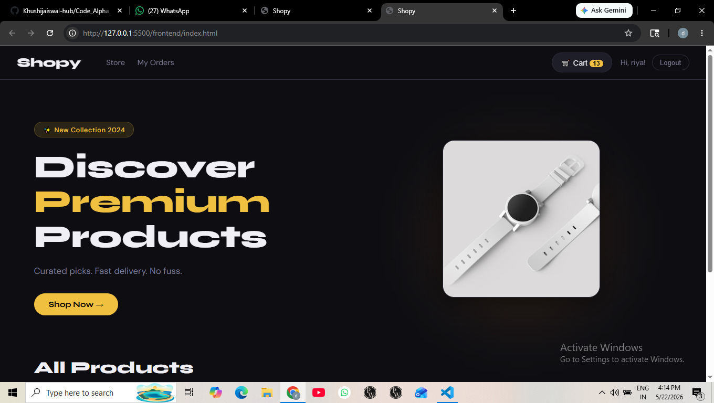
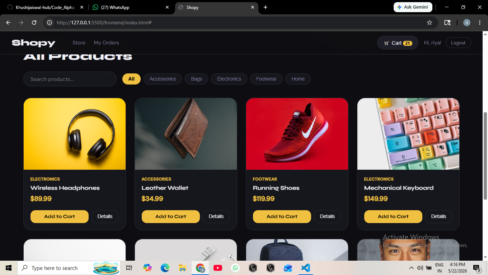
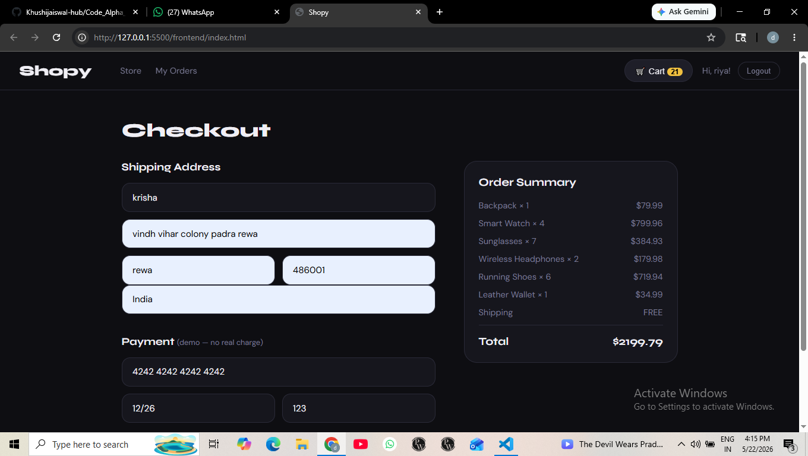

# ShopWave E-Commerce 🛒

A full-stack e-commerce web application built with Express.js and MySQL.
> CodeAlpha Internship Task 1 — Web Development

---

## 🚀 Features

- Browse and view products
- Add products to cart
- User authentication (login/register)
- Order management
- Responsive frontend

---

## 🛠️ Tech Stack

| Layer | Technology |
|-------|-----------|
| Frontend | HTML, CSS, JavaScript |
| Backend | Node.js, Express.js |
| Database | MySQL |

---

## 📁 Project Structure

```
ecommerce/
├── backend/
│   ├── routes/
│   │   ├── auth.js
│   │   ├── orders.js
│   │   └── products.js
│   ├── db.js
│   ├── server.js
│   ├── package.json
│   └── node_modules/
├── frontend/
│   ├── app.js
│   ├── index.html
│   └── style.css
└── .gitignore
```

---

## ⚙️ Setup & Installation

### Prerequisites
- Node.js installed
- MySQL installed and running

### Steps

1. **Clone the repository**
   ```bash
   git clone https://github.com/Khushijaiswal-hub/Code_Alpha_Ecommerce-.git
   cd Code_Alpha_Ecommerce-
   ```

2. **Install dependencies**
   ```bash
   cd backend
   npm install
   ```

3. **Configure the database**
   - Open MySQL and create a database
   - Update your DB credentials in `backend/db.js`

4. **Start the server**
   ```bash
   node server.js
   ```

5. **Open the app**
   - Open `frontend/index.html` in your browser
   - Server runs at `http://localhost:3000`

---

## 🔗 Links

- **GitHub:** https://github.com/Khushijaiswal-hub/Code_Alpha_Ecommerce-
- **Internship:** [CodeAlpha](https://codealpha.tech)

---

## 👩‍💻 Author

**Khushi Jaiswal**  
CodeAlpha full stack develop intern


---

## 📄 License

This project is open source and available under the [MIT License](LICENSE).
<br>



<br>
## Demo Video
[watch Demo](https://drive.google.com/file/d/1LM4Jm3bI1QTDxDNKKVR0_DK08f_cLVcO/view?usp=sharing)

